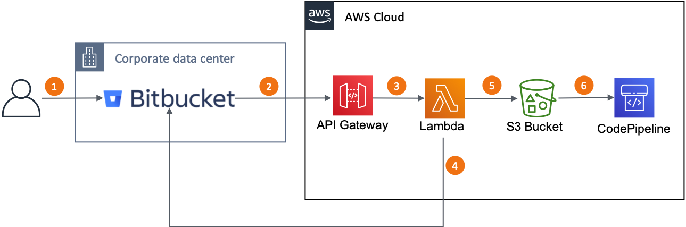

# CodePipeline Integration with Bitbucket Server
This blog post presents a solution to integrate the AWS CodePipeline with Bitbucket Server. If you want to integrate with Bitbucket Cloud, consult this [post](https://aws.amazon.com/blogs/devops/integrating-git-with-aws-codepipeline/). The Lambda Function provided can get the source code from a Bitbucket Server repository whenever the user sends a new code push and store it in a designed S3 bucket.

The Bitbucket Server integration is performed by using webhooks configured in the Bitbucket repository. Webhooks are ideal for this case, and it avoids the need for performing frequent pooling to check for changes in the repository.

Some security protection are available with this solution.
* The S3 bucket has encryption enabled using SSE-AES, and every objected created is encrypted by default.
* The Lambda Function accepts only events signed by the Bitbucket Server.
* All environment variables used by the Lambda Function are encrypted in rest using the AWS Key Management Service (KMS).

## Overview
The figure below shows how the integration works. During the creation of the CloudFormation stack, you can select using API Gateway or ELB to communicate with the Lambda Function.



1. The user pushes code to the Bitbucket repository. 
1. Based on that user action, the Bitbucket server generates a new webhook event and send it to the ELB or API Gateway, based on which endpoint type you selected during the CloudFormation stack creation.
1. The API Gateway or ELB forwards the request to the Lambda Function, which checks the message signature using the **secret** configured in the webhook. If the signature is valid, then the Lambda Function moves to the next step.
1. The Lambda Function calls the Bitbucket server API and requests it to generate a ZIP package with the content of the branch modified by the user in step 1. 
1. The Lambda Function sends the ZIP package to the S3 bucket.
1. The CodePipeline is triggered when it detected a new or updated file in the S3 bucket path.


## Requirements
* Before starting the solution setup, make sure you have an S3 bucket available to store the Lambda Function setup files.
* NPM or Yarn to install the package dependencies
* AWS CLI

## Setup

### Create a personal token on the Bitbucket server
In this step, you create a personal token on the Bitbucket server that the Lambda Function uses to access the repository.

1. Log in into the Bitbucket server.
1. In the top right, click on your user avatar and select the option **Manage Account**. 
1. In the Account screen, select the option **Personal access tokens**.
1. Click in **Create a token**.
1. Fill out the form with the Token name, and in the *Permissions*  section leave as is with Read for Projects and Repositories. Click on the **Create** button to finish.

### Launch a CloudFormation stack
In this step, you upload the Lambda Function and Lambda Layer zip files to an S3 bucket and launch the CloudFormation stack to create the resources on your AWS account.

#### Clone the Git repository containing the solution source code
```bash
git clone https://github.com/aws-samples/aws-codepipeline-bitbucket-integration.git
```

#### Install the NodeJS packages with npm
```bash
cd code
npm install
cd ..
```

#### Prepare the packages for deployment
```bash
aws cloudformation package --template-file ./infra/infra.yaml --s3-bucket your_bucket_name --output-template-file package.yaml
```

#### Edit the CloudFormation  parameters file
Open the file located at infra/parameters.json in your favorite text editor and replace the parameters accordingly.

Parameter Name | Description
------------ | -------------
BitbucketSecret | Bitbucket webhook secret used to sign webhook events. You should define the secret and use the same value here and in the Bitbucket server webhook.
BitbucketServerUrl | URL of your Bitbucket Server e.g. https://server:port
BitbucketToken | Bitbucket server Personal token used by the Lambda Function to access the Bitbucket API. 
EndpointType | Select the type of endpoint to integrate with the Lambda Function. It can be the Application Load Balancer or the API Gateway.
LambdaSubnets | Subnets where the Lambda Function run.
LBCIDR| CIDR allowed to communicate with the Load Balancer. It should allow the Bitbucket server IP address. Leave it blank if you are using the API Gateway endpoint type.
LBSubnets | Subnets where the Application Load Balancer run. Leave it blank if you are using the API Gateway endpoint type.
LBSSLCertificateArn | SSL Certificate to associate with the Application Load Balancer. Leave it blank if you are using the API Gateway endpoint type.
S3BucketCodePipelineName | S3 bucket name that this stack creates to store the Bitbucket repository content.
S3BucketLambda | S3 bucket name where the Lambda function code is stored.
S3KeyLambda | S3 key where the Lambda function zip package is stored.
S3KeyLambdaLayer | S3 key where the Lambda Layer zip package is stored.
VPCID | VPC ID where the Application Load Balancer and the Lambda function run.
WebProxyHost | Hostname of your Proxy server used by the Lambda Function to access the Bitbucket server. If you don't need a web proxy leave it blank. e.g. myproxy.mydomain.com
WebProxyPort | Port of your Proxy server used by the Lambda Function to access the Bitbucket server. If you don't need a web proxy leave it blank.. e.g. 8080

#### Create the CloudFormation stack
```bash
aws cloudformation create-stack --stack-name CodePipeline-Bitbucket-Integration --template-body file://package.yaml --parameters file://infra/parameters.json --capabilities CAPABILITY_NAMED_IAM
```

### Create a webhook on the Bitbucket Server
Now you create the webhook on Bitbucket server to notify the Lambda Function of push events to the repository.

1. Log into the Bitbucket server and navigate to the repository page. 
1. In the left side, click on the **Repository settings** button.
1. In the **Repository settings** screen, click on the **Webhook** option.
1. Click on the **Create webhook** button.
1. Fill out the form with the name of the webhook, for example, CodePipeline.
1. Fill out the **URL** field with the API Gateway or Load Balancer URL. To obtain this URL, click on the Outputs tab of the CloudFormation stack.
1. Fill out the field **Secret** with the same value used in the CloudFormation stack.
1. In the Events section, keep the option **Push** selected.
1. Click on the button **Create** to finish.
1. Repeat these steps for each repository that you want to enable the integration.

### Configure your pipeline
Lastly, change your pipeline on AWS CodePipelinen to use the S3 bucket created by the Cloudformation stack as the source of your pipeline.

The Lambda Function uploads the files to the S3 bucket using the following path structure:
Project Name/Repository Name/Branch Name.zip

Now every time someone pushes code to the Bitbucket repository, your pipeline starts automatically.

## Conclusion
In this post you learned how to integrate your Bitbucket Server with AWS CodePipeline.
