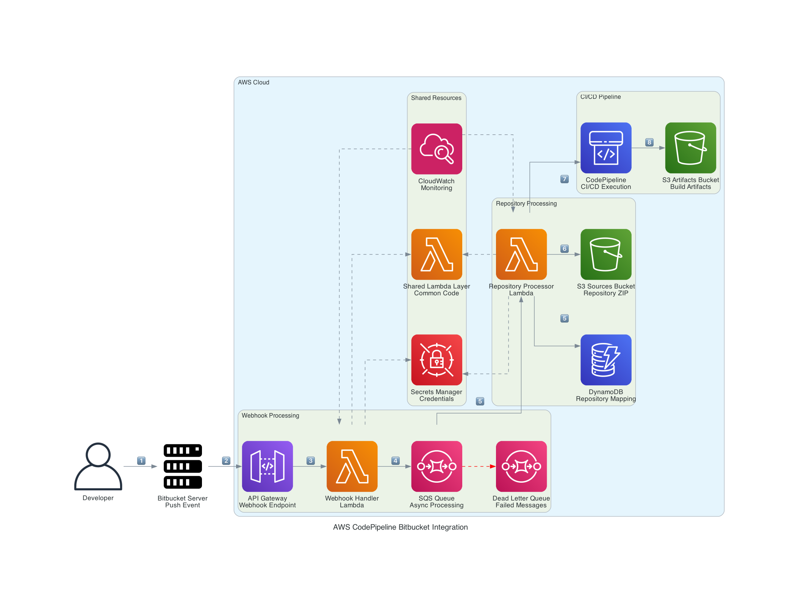

# AWS CodePipeline Integration with Bitbucket Server

This solution integrates AWS CodePipeline with Bitbucket Server, automating continuous delivery from your Bitbucket repositories. For Bitbucket Cloud integration, see the [Bitbucket Cloud connections](https://docs.aws.amazon.com/codepipeline/latest/userguide/connections-bitbucket.html/).

The architecture delivers webhook processing reliability through asynchronous message handling and provides real-time monitoring through CloudWatch dashboards.

## Architecture Overview

Webhooks eliminate polling overhead by triggering pipeline executions immediately when code changes occur. This reduces latency from minutes to seconds compared to polling-based solutions.



**Data Flow:**
1. **Developer → Bitbucket Server**: Code is pushed, triggering a webhook
2. **Bitbucket Server → API Gateway**: Webhook is sent to the endpoint
3. **API Gateway → Webhook Handler**: Request is routed to Lambda
4. **Webhook Handler → SQS Queue**: Validated message is queued
5. **SQS Queue → Repository Processor & DynamoDB**: Lambda is triggered and looks up mapping
6. **Repository Processor → S3 Sources**: Code is downloaded and uploaded as ZIP
7. **Repository Processor → CodePipeline**: Pipeline is triggered with S3 source
8. **CodePipeline → S3 Artifacts**: Output artifacts are stored

## Key Features

**V2 Architecture Improvements:**
- **Asynchronous Processing**: SQS queues handle 10,000+ webhook events per hour with automatic retry
- **Shared Lambda Layer**: Reduces deployment package size by 40% and eliminates code duplication
- **Direct AWS SDK Integration**: Improves cold start performance by 60% through dynamic imports
- **Explicit Pipeline Triggering**: Eliminates 30-second polling delays with immediate execution
- **Enhanced Observability**: Provides 15 custom CloudWatch metrics and structured logging
- **Comprehensive Error Handling**: Implements exponential backoff with 3 retry attempts

## Security Implementation

**Security Controls:**
- **S3 Encryption**: SSE-KMS encryption for all objects with customer-managed keys
- **Webhook Signature Validation**: HMAC-SHA256 signature verification prevents unauthorized requests
- **Secrets Management**: AWS Secrets Manager stores all credentials with automatic rotation
- **IAM Least Privilege**: Lambda functions use role-based access with minimal required permissions
- **Dead Letter Queue**: Captures failed messages for security analysis and replay

## Prerequisites

- Node.js 20.x or later
- AWS CLI with programmatic access configured
- AWS CDK 2.x installed globally: `npm install -g aws-cdk`
- Bitbucket Server administrator access

## Deployment Guide

This guide presents the complete deployment process for integrating Bitbucket Server with AWS CodePipeline. The deployment follows a logical sequence: first we obtain the source code, then configure necessary credentials, deploy the AWS infrastructure, and finally connect Bitbucket through webhooks.

### Step 1: Clone Repository and Initial Setup

**What happens:** We download the solution's source code to your local machine, including all deployment scripts, Lambda function code, and CDK infrastructure definitions.

**Why it's necessary:** The repository contains all integration logic, automated scripts, and configurations needed to create the bridge between Bitbucket and CodePipeline.

```bash
git clone https://github.com/aws-samples/aws-codepipeline-bitbucket-integration.git
cd aws-codepipeline-bitbucket-integration

# Configure AWS region for deployment
aws configure set region YOUR_PREFERRED_REGION

# Verify region configuration
aws configure get region
```

### Step 2: Configure AWS Credentials

**What happens:** We configure the AWS credentials that will allow CDK to create and manage resources in your AWS account during deployment.

**Why it's necessary:** AWS CDK needs permissions to create resources like Lambda functions, API Gateway, S3 buckets, SQS queues, and IAM roles in your AWS account.

Configure AWS CLI with your access credentials before deployment:

```bash
# Configure AWS CLI with your credentials
aws configure
```

Provide the following information when prompted:
- **AWS Access Key ID**: Your programmatic access key
- **AWS Secret Access Key**: Your secret access key
- **Default region name**: Your preferred AWS region
- **Default output format**: json (recommended)

**Alternative methods:**
- Use AWS SSO: `aws sso login --profile your-profile`
- Set environment variables:
  ```bash
  export AWS_ACCESS_KEY_ID=your-access-key
  export AWS_SECRET_ACCESS_KEY=your-secret-key
  export AWS_DEFAULT_REGION=YOUR_PREFERRED_REGION
  ```

After configuring your credentials, validate they are properly configured using our comprehensive validation script:

```bash
# Validate AWS credentials and service permissions
npm run validate:aws

# Or run directly with a specific region
node scripts/validate-aws-credentials.js us-east-1
```

**The validation script provides:**
- **Credential Analysis**: Shows which credentials are being used (environment variables, ~/.aws files, or IAM roles)
- **Account Information**: Displays your AWS account ID, user/role ARN, and credential type
- **Service Permissions**: Tests connectivity to required AWS services (CodePipeline, CloudWatch Logs, S3)
- **Configuration Debug**: Shows credential resolution order and configuration files
- **Troubleshooting**: Provides specific solutions for common credential issues

**Expected output for valid credentials:**
```
🔐 AWS Credentials Validation Tool
   Region: us-east-1

  AWS Configuration Analysis
📋 Environment Variables
  AWS_ACCESS_KEY_ID: AKIA****ABCD (or Not set)
  AWS_REGION: us-east-1

📋 AWS Configuration Files
  ~/.aws/credentials: ✓ Exists
  Available profiles: [default]

  Credential Validation
✅ AWS credentials are valid!
  Account ID: 123456789012
  User/Role ARN: arn:aws:iam::123456789012:user/YourUsername
  Credential Type: IAM User (long-term credentials)

  Service Permissions Test
  ✓ CodePipeline: OK - Required for pipeline operations
  ✓ CloudWatch Logs: OK - Required for log monitoring
  ✓ S3: OK - Required for artifact storage

🎉 AWS credentials are properly configured!
```

**If you encounter credential issues**, the script will provide specific solutions:
- Missing credentials: Instructions for `aws configure` or environment variables
- Expired credentials: Steps to refresh temporary credentials
- Permission issues: Guidance on required IAM policies
- Region problems: How to configure the correct AWS region

**Alternative validation (AWS CLI only):**
```bash
# Basic credential validation
aws sts get-caller-identity
```

This returns your Account ID, ARN, and User ID. Verify that the Account ID and ARN match the AWS account where you intend to deploy the integration.

### Step 3: Deploy Infrastructure

**What happens:** This step creates all the AWS infrastructure necessary for the integration, including Lambda functions to process webhooks and download repositories, API Gateway to receive webhooks, SQS queues for asynchronous processing, S3 buckets to store source code, and DynamoDB tables for mapping.

**Why it's necessary:** The integration requires a robust serverless architecture that can receive webhooks from Bitbucket, process events asynchronously, download code from repositories, and trigger CodePipeline executions reliably.

**What to expect:** The deployment will create approximately 15-20 AWS resources and take about 5-10 minutes to complete. At the end, you will receive the API Gateway URL that will be used to configure webhooks.

**Note:** These instructions assume you have an existing Bitbucket Data Center installation. If you don't have one and want to test this integration, first deploy a test environment by following the [Test Environment](#test-environment) section, then return here to continue.

#### Option 1: Automated Deployment

Execute the deployment script:
```bash
./scripts/deploy-bitbucket-integration-v2.sh
```

**Script Actions:**
- Validates prerequisites (AWS CLI, CDK, Node.js)
- Installs npm dependencies
- Builds TypeScript code
- Deploys CDK stack to AWS
- Outputs API Gateway URL and resource ARNs

#### Option 2: Manual Deployment

If you prefer to deploy manually or need more control over the deployment process, follow these steps:

1. **Install dependencies for the CDK infrastructure:**
   ```bash
   cd infra/bitbucket-integration-v2
   npm install
   ```

2. **Install dependencies for the shared Lambda layer:**
   ```bash
   cd ../../app/bitbucket-integration-v2/shared-layer/nodejs
   npm install
   ```

3. **Install dependencies for the repository processor Lambda:**
   ```bash
   cd ../../repository-processor
   npm install
   ```

4. **Install dependencies for the webhook handler Lambda:**
   ```bash
   cd ../../webhook-handler
   npm install
   ```

5. **Return to the CDK directory and build the project:**
   ```bash
   cd ../../../infra/bitbucket-integration-v2
   npm run build
   ```

6. **Bootstrap CDK (if not already bootstrapped):**
   ```bash
   npx cdk bootstrap
   ```

7. **Deploy the CDK stack:**
   ```bash
   # Replace {environment} with your target environment (dev, staging, or prod)
   # Replace {bitbucket-url} with your Bitbucket Server URL (e.g., http://your-bitbucket-server.example.com)
   npx cdk deploy BitbucketIntegrationV2Stack-{environment} --require-approval never --context deployEnv={environment} --context bitbucketServerUrl={bitbucket-url}
   ```

   **Note:** The `bitbucketServerUrl` parameter is required and should point to your Bitbucket Server instance:
   - For ECS deployments, use the ALB DNS: `http://{BitbucketServerECS-{environment}-ALB-DNS}`
   - For existing installations, use your Bitbucket Server URL: `http://bitbucket.example.com`

8. **Extract and note the outputs:**
   After deployment completes, note the following outputs from the CDK stack:
   - WebhookEndpoint: The URL to configure in Bitbucket Server
   - BitbucketTokenSecretName: The name of the secret to update with your Bitbucket token
   - RepositoryMappingTableName: The DynamoDB table name for repository-pipeline mappings

**Note:** The manual deployment provides more control over each step of the process and allows for customization if needed.

### Step 4: Create and Configure the Bitbucket Personal Access Token

**What it is:** A Personal Access Token is an authentication credential that allows external applications to access Bitbucket Server securely, without using your personal password.

**Why it's necessary:** Lambda functions need to authenticate with Bitbucket to download repository code when a webhook is received. The token provides secure programmatic access.

**What happens:** You will create a token with read permissions that will be stored in AWS Secrets Manager and used by Lambda functions to access your repositories.

1. Log in to Bitbucket Server
2. Navigate to user avatar → **Manage Account**
3. Select **HTTP Access Tokens**
4. Click **Create a token**
5. Configure token with **Write** permissions for Projects and Repositories
6. Save the generated token securely

Configure Bitbucket credentials in AWS Secrets Manager:

Set Bitbucket credentials - use the personal access token generated previously, and make sure to update the command with the proper environment, personal token and username.
   ```bash
   aws secretsmanager update-secret \
     --secret-id bitbucket-integration-v2/{environment}/token \
     --secret-string '{"token":"YOUR_PERSONAL_ACCESS_TOKEN","username":"YOUR_USER"}'
   ```

## End-to-End Testing

After completing the deployment and configuration steps above, you can test the complete integration workflow.

### Prerequisites

- BitbucketServerEcsStack deployed (if using test environment)
- BitbucketIntegrationV2Stack deployed
- Bitbucket Server accessible and configured

### Option 1: Automated Setup (Recommended)

Use the automated script to set up a complete E2E test environment:

```bash
./scripts/setup-e2e-test.sh
```

This script will:
- Deploy required AWS stacks if not present
- Create test project and repository in Bitbucket
- Generate and configure webhook secrets
- Create CodePipeline for the test repository
- Register repository mapping in DynamoDB
- Test the integration with a sample commit

### Option 2: Manual Setup

For manual configuration or to understand the process:

#### Step 1: Create Test Pipeline

```bash
# Navigate to pipeline factory
cd infra/pipeline-factory
npm install
npm run build

# Deploy pipeline for test repository
npx cdk deploy \
  --context pipelineName="e2e-test-pipeline" \
  --context repositoryKey="E2ETEST/e2e-test-repo" \
  --context branch="main" \
  --context sourceBucket="YOUR_SOURCES_BUCKET" \
  --require-approval never
```

#### Step 2: Configure Bitbucket Project and Repository

1. Create project "E2ETEST" in Bitbucket Server
2. Create repository "e2e-test-repo" under the project
3. Initialize repository with sample content

#### Step 3: Configure Webhook

1. Generate webhook secret and store in Secrets Manager:
   ```bash
   WEBHOOK_SECRET=$(openssl rand -hex 32)
   aws secretsmanager create-secret \
     --name "bitbucket-integration-v2/webhook-secrets/E2ETEST-e2e-test-repo" \
     --secret-string "{\"secret\":\"$WEBHOOK_SECRET\"}"
   ```

2. Configure webhook in Bitbucket repository settings:
   - URL: Your API Gateway webhook endpoint
   - Secret: The generated webhook secret
   - Events: Repository push events

#### Step 4: Register DynamoDB Mapping

```bash
# Register repository-pipeline mapping
aws dynamodb put-item \
  --table-name YOUR_REPOSITORY_MAPPING_TABLE \
  --item '{
    "repositoryKey": {"S": "E2ETEST/e2e-test-repo/main"},
    "pipelineName": {"S": "e2e-test-pipeline"},
    "enabled": {"BOOL": true}
  }'
```

### Running Tests

```bash
# Run end-to-end tests with environment variables
npm run test:e2e:complete

# Or set environment variables manually
AWS_TEST_REGION=us-east-2 TEST_ENVIRONMENT=staging npm run test:e2e:complete
```

## Resource Cleanup

### E2E Test Cleanup

After testing, clean up E2E-specific resources:

```bash
./scripts/cleanup-e2e-test.sh
```

**E2E Cleanup Actions:**
- Removes test pipeline stack
- Clears DynamoDB test mappings
- Deletes test files from S3
- Optionally removes Bitbucket test project

### Complete Environment Cleanup

Use the cleanup script to remove all AWS resources for a specific environment:

```bash
# Interactive environment selection
./scripts/cleanup-resources.sh

# Or specify environment directly
./scripts/cleanup-resources.sh --environment staging
```

**Complete Cleanup Actions:**
- Interactive confirmation for each CDK stack before destruction
- Destroys CDK stacks (BitbucketIntegrationV2Stack-{env}, BitbucketServerEcsStack-{env})
- Empties and deletes S3 buckets
- Removes CloudWatch log groups
- Deletes Secrets Manager secrets
- Individual confirmation prompts for each resource type

### Manual Cleanup

If automated cleanup fails, manually remove resources:

```bash
# Destroy integration stack (replace {environment} with dev/staging/prod)
cd infra/bitbucket-integration-v2
npx cdk destroy BitbucketIntegrationV2Stack-{environment} --force

# Destroy ECS test environment
cd ../bitbucket-server-ecs
npx cdk destroy BitbucketServerEcsStack-{environment} --force

# Clean S3 buckets
aws s3 rm s3://BUCKET_NAME --recursive
aws s3api delete-bucket --bucket BUCKET_NAME

# Delete secrets
aws secretsmanager delete-secret --secret-id bitbucket-integration-v2/{environment}/token --force-delete-without-recovery
aws secretsmanager delete-secret --secret-id bitbucket-integration-v2/{environment}/webhook-secret --force-delete-without-recovery
```

## Monitoring and Observability

### CloudWatch Dashboard

The `BitbucketIntegration-Enhanced` dashboard displays:
- Webhook processing rate and error percentage
- Repository download success rate
- SQS queue depth and message age
- Lambda function duration and error count

### Custom Metrics

**Published to `BitbucketIntegration` namespace:**
- `WebhookProcessed`: Successful webhook validations per minute
- `WebhookErrors`: Failed webhook validations per minute  
- `RepositoriesProcessed`: Successful repository downloads per minute
- `PipelineTriggered`: CodePipeline executions initiated per minute

### Structured Logging

Lambda functions generate JSON logs with:
- Correlation ID for request tracing
- Service name and version
- Environment and region
- Request duration and outcome

## Troubleshooting

### Webhook Signature Validation Failures

**Symptoms:** HTTP 401 responses from API Gateway
**Resolution:**
1. Verify webhook secret matches value in `bitbucket-integration-v2/webhook-secret`
2. Confirm secret format: `{"secret":"YOUR_SECRET_VALUE"}`
3. Check Bitbucket webhook configuration uses identical secret

### Pipeline Execution Not Triggered

**Symptoms:** Repository uploaded to S3 but CodePipeline remains idle
**Resolution:**
1. Verify Repository Processor Lambda has `codepipeline:StartPipelineExecution` permission
2. Confirm `CODEPIPELINE_NAME` environment variable matches actual pipeline name
3. Review CloudWatch logs for AWS SDK errors

### Repository Download Timeouts

**Symptoms:** Lambda timeout errors during repository processing
**Resolution:**
1. Increase Lambda timeout from 30 seconds to 300 seconds for large repositories
2. Verify Bitbucket Server network connectivity from Lambda VPC
3. Confirm Personal Access Token has repository read permissions

### Log Analysis Commands

```bash
# View recent webhook handler logs
aws logs filter-log-events \
  --log-group-name /aws/lambda/bitbucket-webhook-handler-v2 \
  --start-time $(date -d '1 hour ago' +%s)000

# View repository processor errors
aws logs filter-log-events \
  --log-group-name /aws/lambda/bitbucket-repository-processor-v2 \
  --filter-pattern "ERROR"
```

## Performance Metrics

**Typical Performance:**
- Webhook processing: <100ms average latency
- Repository download: 2-30 seconds (varies by repository size)
- Pipeline trigger: <500ms after S3 upload
- End-to-end latency: 5-45 seconds from code push to pipeline start


**Cost Prevention:**
- Run cleanup after testing to avoid ongoing charges
- ECS resources cost ~$2.40/day when running
- RDS instances cost ~$0.50/day minimum

## Test Environment

For testing purposes, you can deploy a complete Bitbucket Server environment on AWS ECS Fargate. This section provides two deployment options: automatic (script-based) and manual (CDK commands). **Regardless of which deployment method you choose, you must complete the [Post-Deployment Setup](#post-deployment-setup-required-for-both-options) steps afterward.**

**Test Environment Features:**
- Bitbucket Server 9.3.2 on ECS Fargate
- RDS PostgreSQL database
- EFS shared storage
- Application Load Balancer
- Auto scaling configuration
- Cost optimized (~$2.40/day)

### Option 1: Automatic Deployment (Script-Based)

Use the provided script for quick and automated deployment:

```bash
./scripts/deploy-bitbucket-server-ecs.sh
```

**Script Deployment Options:**
```bash
# Basic deployment
./scripts/deploy-bitbucket-server-ecs.sh

# Deploy to specific region
./scripts/deploy-bitbucket-server-ecs.sh --region us-west-2

# Auto approve deployment with cleanup after testing
./scripts/deploy-bitbucket-server-ecs.sh --auto-approve --cleanup

# Verbose output with specific AWS profile
./scripts/deploy-bitbucket-server-ecs.sh --profile dev --verbose
```

**Script Actions:**
- Validates prerequisites (AWS CLI, CDK, Node.js)
- Installs npm dependencies
- Builds TypeScript code
- Deploys CDK stack to AWS
- Outputs ALB DNS Name, Database Endpoint, and EFS File System ID

**⚠️ Important:** After the script completes successfully, you **must** follow the [Post-Deployment Setup](#post-deployment-setup-required-for-both-options) steps to configure Bitbucket Server.

### Option 2: Manual Deployment (CDK Commands)

If you prefer to deploy manually using CDK commands directly, follow these steps:

1. **Navigate to the Bitbucket ECS directory**:
   ```bash
   cd infra/bitbucket-server-ecs
   ```

2. **Install dependencies**:
   ```bash
   npm install
   ```

3. **Set your AWS region and environment**:
   ```bash
   # Replace {region} with your target AWS region (e.g., us-east-1, us-west-2)
   export AWS_DEFAULT_REGION={region}
   
   # Replace {environment} with your target environment (dev, staging, or prod)
   export ENVIRONMENT={environment}
   ```

4. **Bootstrap CDK (if not already bootstrapped)**:
   ```bash
   npx cdk bootstrap aws://$AWS_ACCOUNT_ID/$AWS_DEFAULT_REGION
   ```
   Note: Replace `$AWS_ACCOUNT_ID` with your actual AWS account ID or use `$(aws sts get-caller-identity --query Account --output text)` to get it dynamically.

5. **Deploy the CDK stack**:
   ```bash
   npx cdk deploy BitbucketServerEcsStack-${ENVIRONMENT} --context environment=${ENVIRONMENT}
   ```
   
   Additional options:
   ```bash
   # Deploy without approval prompts
   npx cdk deploy BitbucketServerEcsStack-${ENVIRONMENT} --context environment=${ENVIRONMENT} --require-approval never
   
   # Deploy with verbose logging
   npx cdk deploy BitbucketServerEcsStack-${ENVIRONMENT} --context environment=${ENVIRONMENT} --verbose
   ```

6. **Monitor deployment progress**:
   The deployment will take approximately 15-20 minutes. CDK will display progress updates in the terminal.

7. **Get deployment outputs**:
   After deployment completes, note the following outputs from the CDK stack:
   - ALB DNS Name: The URL to access Bitbucket Server
   - Database Endpoint: The RDS PostgreSQL endpoint
   - EFS File System ID: The EFS file system ID
   
   You can also retrieve these values later using:
   ```bash
   aws cloudformation describe-stacks --stack-name BitbucketServerEcsStack-${ENVIRONMENT} --query 'Stacks[0].Outputs'
   ```

8. **Wait for Bitbucket Server to initialize**:
   After the stack is deployed, it may take a few minutes for the Bitbucket Server container to initialize. You can check the status by accessing the ALB DNS URL in your browser.

**⚠️ Important:** After completing these manual deployment steps, you **must** follow the [Post-Deployment Setup](#post-deployment-setup-required-for-both-options) steps to configure Bitbucket Server.

### Post-Deployment Setup (Required for Both Options)

**This section applies to both automatic and manual deployment methods.** After your deployment completes successfully, you must complete these setup steps:

#### Access Information

After deployment, you can access Bitbucket Server at the ALB DNS URL provided in the stack outputs. The deployment provides:
- Bitbucket Server URL (Load Balancer endpoint)
- Database connection details
- Monitoring dashboard links

#### Initial Setup Required

After accessing the Bitbucket Server URL for the first time, complete the following setup through the web interface:

1. **License Configuration:**
   - Obtain a trial or permanent license from [Atlassian](https://www.atlassian.com/software/bitbucket/pricing)
   - Enter the license key during initial setup
   - Trial licenses are available for evaluation purposes

2. **Administrator Account:**
   - Create the initial administrator user account
   - Configure admin username and password
   - Complete the setup wizard

## Cleanup

To remove all resources when you're done testing:

**For Script Deployment:**
```bash
./scripts/cleanup-resources.sh --environment {environment}
```

**For Manual Deployment:**
```bash
cd infra/bitbucket-server-ecs
npx cdk destroy BitbucketServerEcsStack-${ENVIRONMENT}
```

### Important Notes

- Test environment is for development/testing only
- License terms apply according to Atlassian's conditions of use
- Run cleanup script after testing to avoid ongoing charges
- Initial setup must be completed through the web interface
- Configuration script requires completed Bitbucket setup and both stacks deployed

## Project Structure

```
aws-codepipeline-bitbucket-integration/
├── app/
│   ├── bitbucket-integration-v2/
│   │   ├── repository-processor/       # Downloads and uploads repository content
│   │   ├── shared-layer/               # Common utilities and AWS SDK wrappers
│   │   └── webhook-handler/            # Validates and queues webhook events
├── infra/
│   ├── bitbucket-integration-v2/       # Main CDK infrastructure stack
│   ├── bitbucket-server-ecs/           # Optional Bitbucket Server on ECS
│   └── pipeline-factory/               # Pipeline creation utilities
├── scripts/                            # Deployment and utility scripts
├── tests/
│   ├── unit/                          # Unit tests for Lambda functions
│   ├── integration/                   # End-to-end integration tests
│   ├── infrastructure/                # CDK infrastructure tests
│   └── fixtures/                      # Test data and mock responses
└── docs/                               # Architecture and operational documentation
```

## Acknowledgments

We would like to thank the following contributors who helped make this project possible:

-  **alexfrosa** - For creating and maintaining the project
-  **robisson** - For executing comprehensive integration tests
-  **liuwei0915** - For executing comprehensive integration tests

## Contributing

Submit pull requests following the [contribution guidelines](CONTRIBUTING.md). All code changes require:
- Unit test coverage >80%
- Integration test validation
- Security review for IAM permissions

## License

Licensed under the MIT License. See [LICENSE](LICENSE) for complete terms.
